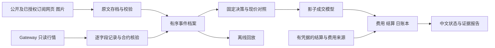

# 开发与阶段验证方案

版本：0.4 · 2026-09-15 · 状态：首轮 IMPLEMENTING，正式研究设计 IN_REVIEW。U09 已授权立即施工及今日影子诊断；已实施的具体工程选择见 [实施基线](IMPLEMENTATION_BASELINE.md)，命令与证据见 [运行手册](../RUNBOOK.md)。下文保留完整目标设计，不能把尚未实现部分算作已完成。

已确认需求见 [决策记录](DECISIONS.md)。本文件提出收拢后的完整路线和第一轮设计；未确认的技术建议不冒充冻结规范。原依据为 [交接研究协议](/Users/logan/Codex/2026-09-15/yan/outputs/spx-project-handoff/02_RESEARCH_PROTOCOL.md)、[系统设计](/Users/logan/Codex/2026-09-15/yan/outputs/spx-project-handoff/03_SYSTEM_DESIGN.md) 和 [阶段计划](/Users/logan/Codex/2026-09-15/yan/outputs/spx-project-handoff/04_DELIVERY_PLAN.md)。

## 1. 目标与成功标准

最终目标是在经过验证的规则及明确资金边界内自动交易 SPXW 蝶式。用户明确优先独立蝶式的筛选和定价。首先保留基线问题：事前实际取得的中位数，能否帮助选择一组当时可报价的期权结构，在计费及执行约束后产生相对现价中心的增量结果。

用户已确认第一轮同时交付 V0、现价对照、费用、结算及一日完整影子闭环。它是工程与研究工具的首个交付，不等于确认策略有效，也不宣称复刻作者未公开择时或持仓管理。

[作者策略重建](BALDER_STRATEGY_RECONSTRUCTION.md)进一步提出 S/F/FG/FP/FGP 五账本比较，以分开衡量中点、筛选、选价及交互作用。用户已确认五账本首轮完整交付（U08），包括费用、结算和回放。G0/P0 为自定义简化规则，完整 quiet gate 未公开，精确定义仍待 D02 定稿。不得静默修改 V0，也不得将整体股票/期权 Agent 收益记入独立蝶式。

| 要求 | 可观察的结果 |
|---|---|
| R01 事前档案 | 能打开每个决策引用的原网页/图像，看到接收、校验、目标日期及版本 |
| R02 公平对照 | 同一计划日、同一截止规则下保存 S/F/FG/FP/FGP 五账本的选择、拒绝及结果；分别评价预测、筛选、选价 |
| R03 扣费结算 | 区分直接费用、固定开支、假设兑付、正式结算与未知项；不填造收益 |
| R04 可回放 | 离线重放相同输入及规则，得到相同选择、跳过原因、影子结果和语义账本 |
| R05 模式隔离 | 影子运行不加载可提交券商订单的执行实现，无影子到实盘的自动转换 |
| R06 可持续观察 | 服务健康、数据缺口、完整计划日和恢复过程可见；聊天结束不构成服务监督 |

## 2. 首轮架构和数据责任

建议本地、单用户、模块化 Python 服务，先一个写入进程；不预建分布式服务。Python 版本及官方 IB API / ib_async 选型在技术决定中记录，实施获准后再锁定和验证。

模块职责：ForecastAdapter 管来源与候选解释；InstrumentService 管真实合约；Collector 管行情与字段事件；QualityGate 管资格；StrategyEngine 只生成意图；ShadowFillModel 管反事实成交；Settlement/Ledger 管结果；Reporter/Replay 管展示与复现。

未来 BrokerExecutor、统一 RiskEngine、Reconciler 保留接口边界。首轮不实现可提交订单的运行路径，也不因目标架构包含它们就提前做 P3。

### 存储建议

以 SQLite WAL 中的追加事件及事务索引为首轮记录依据；原始网页和图像按内容哈希存文件。Parquet 是可重建的行情归档/分析导出，DuckDB 为后续离线分析选项，避免把两个独立写入位置都当作唯一真相。

原始文件落盘成功后再提交引用事件，记录失败和未完成写入。导出或报告失败不丢弃已经确认的事件。预定交易日日历独立保存，用于发现整日宕机；启动后显示缺口，不伪造此前运行过。

确定性回放比较业务结果和规范化序列化内容，不把每次报告生成时间等非业务字段混入同一结果哈希。事件全序、计时器、时区、合约、费用和结算版本均随回放保存。

## 3. 预测来源接入

用户已有 X 订阅，并授权本次浏览；已验证部分订阅正文可读。建议首版分别支持公开来源与授权订阅来源的留档、人工校验。自动持续接入方式仍需明确，不能把本次浏览能力写成现成采集器；不假设已有邮件或私有 API，是否引入模型提取仍待 D01。

X 作者主页是身份入口，具体 post_id/原帖 URL 才是内容定位。日内预测、评论纠错、事后结果、盘前/周末映射和股票产品分开标类型；仿冒昵称不等于同一作者。回复拥有独立发布时间和实际可用时间。显示“上次编辑”时，不能把该字段误称原始首次发布时刻；原始版本未知则保留未知。

每个网页和引用图像各有 raw_asset_id、来源 URL、实际接收时间、内容哈希和归档位置。将同一次关联捕获记为 capture_id，图像后来下载不能借用更早网页时间。反复抓到同一内容可记录观察事件，不重复制造新的预测版本。

目标日期、目标 PM 结算、明确中位数、概率带语义必须可从原文证据或有据人工校验得到。`available_at` 不早于全部必要原始资产到达及校验完成时间。标题 Tomorrow 与日期不一致、同页隐藏板块、图片被替换或字段缺失时隔离。

建议分开三个状态：来源结构可以解析；内容校验通过；某实验在某截止时刻可用。只有最后一层通过才能供 V0 使用。人工第二天补录仅是事后解释，不重写昨日可用性。

来源修订和撤回保留新事件。若新版明确撤回旧预测，不再将已撤回旧版当“最新有效版”静默使用；无法确认修订含义时隔离相关目标。正式期的回退规则需要预注册。

### 字段含义与图文冲突

新增[用户样本审查](samples/2026-09-15-user-submission/README.md)显示：图中 median 被配文称为“最可能收盘”，图中 Tomorrow 与配文今日并存，VRP 仅出现在配文。接入契约应逐字段保存来源资产、原标签、定位与解释类型，而非只留下一个没有语义的数值。

- 点预测区分 median、mode、mean 和未明确类型；V0 只接受有据的 median，不能由配文中的“最可能”或区间中点补造。
- 区间保存声明概率、终值/路径事件、目标期限及区间构造类型（未知则保留未知）；touch 概率另存水平、方向/事件定义、窗口，不能写入终值概率或交易胜率。
- 单位或期限未知的 VRP/expected move 保留原值与未知原因，不能倒推缺失字段。模型模拟条数、校准样本量和真实样本外样本量分开。
- 图文各自保存，出现语义差异需有据裁定。统计量冲突、目标不明、可用性未证明分别保留原因；不能采用通用“图片永远优先”规则。缺非 V0 必需的 VRP 不必单独阻止 V0，但目标或必需点预测无法裁定时隔离。

来源核验与实验资格继续分开：事后查到更早的原帖发布时间，不自动证明系统当时已接收并完成校验；人为补录的推定时间不能覆盖当时记录。

本次还读到同日相同点位、不同 Gamma 解释的两个帖子，以及评论纠正正文点位的案例。点位不变不代表内容版本不变；概率带从 90% 改到 50% 不能当作同一个字段的数值变化。显式 gamma_regime 与 spot/Flip 相对位置分开保存，不能用价位关系代替未知的综合模型。事实和来源链接见[策略重建第 7 节](BALDER_STRATEGY_RECONSTRUCTION.md#7-已发现的档案和解释风险)。

## 4. 时间、行情与决策建议

### 事件结构

采用外层事件信封加领域内容，解决 F03：外层保存 event_id、event_type、schema_version、recorded_at、producer_version、mode、correlation_id、持久化序号和运行标识；内容保存 ForecastSnapshot、MarketEvent 等各自字段与版本。当前只定义规范，不修改或导入原 Schema。

接收壁钟时间用于 UTC 证据；进程内单调时间用于延迟计算；持久化序号和运行/连接世代用于排序。时钟健康状态单独记录，重启后不跨世代直接比较单调时钟数值。

### V0 调试基线

保留交接参数作为可调整的调试提案：纽约 10:05:00 截止、至 10:05:15 的窗口、25 点翼宽、同日 PM、明确中位数最近挂牌中心且等距取低、最多一组、含估计直接费用不超过 6.25 点、持有至正式结算。宏观事件日保留，半日市事前排除。12:30 更新仅归档。

建议把以下边界写成确定规则后再实现：

1. 截止时以已处理事件冻结最新有效预测及最近合格 SPX，分别确定两个中心。两账本使用同一现价质量要求；缺预测只阻止 Balder，不阻止现价对照；缺合格 SPX 则两账本均不建立新意图。
2. 冻结后不能因更晚预测或指数跳动重选中心。两翼不挂牌则拒绝，不自动寻找另一个更有利中心。
3. 截止、延迟开始与结束作为显式计时器事件。相同时间按确定的事件优先级与持久化序号处理。边界上是否包含该时刻输入必须在契约中固定，禁止依赖线程调度偶然决定。
4. 候选选择使用首个合格状态；延迟 1 秒后至意图后 3 秒或总窗口截止，以先到者为限，再检查首个合格状态。计时器可评估缓存，但必须重新验证字段年龄、数量和连接世代。
5. 先实现交接的成本上限内 natural ask 影子模型，并在报告显著标明其反事实含义。正式预注册前决定是否改成固定初始限价模型；任何改动生成新模型版本。

两组选择同一中心时仍保留两个反事实账本；若资格、意图时点和其余条件相同，应使用相同事件及成交假设，避免因顺序处理人为制造价差或让一组消耗另一组的影子流动性。报告全体计划日与中心相同/不同频率，不事后删除相同中心日；图上现货不能替代截止时合格 SPX。

合约信息和有限范围订阅须在截止前预热。不能假定“最终最多六个去重合约”就足以保证临时新中心的订阅准备。记录订阅覆盖、响应时间和拒绝率后选定有限缓冲范围及资源上限。

bid、ask、各自数量、last、Greeks 各保留自己的来源事件和时间。数据类型降级、断线或连接世代变化使旧状态失去新意图资格。价格合法不等于数量及时；Greeks 更新不能刷新盘口年龄。原 2 秒/1 秒筛选只在调试后正式冻结。

### 缺失与没有交易

| 情况 | 结果建议 |
|---|---|
| 规则明确拒绝入场，无意图产生 | NO_TRADE；零交易损益，仍计固定成本及质量影响 |
| 意图后观察完整，未遇合格状态 | ASSUMED_NO_FILL；记录具体原因 |
| 意图后必要窗口缺失，不能判定 | INDETERMINATE；不得补成零或成交 |
| 已假设成交但正式结算/费用未齐 | 交易结果 pending，可单列估算 |
| 服务整日未运行 | 日历报告 SERVICE_NOT_OBSERVED/缺失；不伪造当日 Decision 事件 |

最终是否仍可计算某种“实际部署缺信号便不交易”的收益，由预注册口径定义；必须与“完整数据下策略会怎样”的反事实区分，保留全部计划日和未知影响。

## 5. 费用、结算与评价

主场景使用自然买入合成报价与确认适用的费用估计。midpoint 和额外 0.25/0.50/1.00 点成本作为同一候选的敏感性。若对应另一侧报价不合格，中间价情景单独标缺失，不影响已经可验证的主场景。

每组四份合约。费制需覆盖计划、路由、最低收费及适用第三方费用；收到费用修订后追加。影子没有实际佣金流水，费用模型只能标估计，不能展示为券商实际收费。官方费表区分按合约收费、最低订单费用及第三方费用，不能仅固定乘一个单一佣金数。[IBKR 费用](https://www.interactivebrokers.com/en/pricing/commissions-options.php)

固定成本独立于交易直接费用，分别给出单独部署口径和共享设施增量口径。主统计以 USD/计划交易日展示绝对结果及成对差值。每 $1,000 的数值标为固定名义规模的标准化值，不冒充账户复利回报。

结算先支持有来源凭据的人工确认或可验证自动来源。保存 SPXW_PM、日期、对应系列、发布时间/接收时间、原始引用、状态和修订。盘中 SPX、最后一分钟、日线收盘及现金到账是不同记录，不能替换来源定义。结算源和费制未解决则一日净收益闭环尚未完成。

报告同时回答：全部计划日有多少；有效预测/行情有多少；为什么跳过；有多少假设成交、未成交、未知结果；假设净损益及对照差值是多少；费用和结算有何限制。预测中位数误差与概率带覆盖单独评价，缺完整分布时不输出来源未提供的 EV 或胜率。

## 6. 第一轮工作顺序及验收

以下是方案确认后的工作顺序，目前均未实施。

| 步骤 | 交付 | 前提 | 验收证据 |
|---|---|---|---|
| M0 基线与契约 | 活跃规范、依赖选择、模式和数据契约 | 方案确认及实施授权；F03–F07 语义定清 | 文档/配置版本、字段正反例；不复制旧临时环境 |
| M1 档案与行情 | 已授权来源预测资产、逐字段报价、质量与缺口 | 来源语义方案及 Gateway 只读连接范围 | 新的真实只读采集记录、原文、合约核验 |
| M2 离线完整闭环 | 五账本、费用、假设成交、结算和回放 | M0、确定的规则和数据接口 | 正反例覆盖，确定性回放，明确标记夹具 |
| M3 真实一日观察 | 真实输入驱动的全日与窗口报告 | M1/M2；费用和结算来源可核验 | 一日证据链、五个账本、结算状态、离线重放一致 |
| M4 连续运行验收 | 运行手册、恢复记录和覆盖报告 | 主机、存储、认证责任及采集时段明确 | 按约定交易日观察，失败与缺失全部可见 |

首轮需覆盖完整流程，不以界面演示结束。实际当天没有合格机会时如实 NO_TRADE；用独立夹具验证成交分支，不把夹具伪装成市场机会。若一直没有有效 Balder 预测，可验收基础设施与现价分支，但不能声称已完成真实 Balder 信号闭环。

按 U08，M0 同时冻结五账本调试契约，M1 增加有限候选的预热覆盖，M2/M3 完成全部账本的费用、结算及回放；另验收 B21（筛选代理不冒充 quiet）、B22（候选缺报价不宣称最便宜）、B23（评论修订不倒灌截止前）、B24（独立策略不混组合收益）。不得只采集候选就宣称完成新增三账本，不默认无限扩大订阅范围，也不将五个反事实账本当成五组实盘仓位。

延续原 P1 建议：至少 5 个正常完整观察日、决策日志覆盖 100%、至少 3 日合格的必要报价及有效事前预测；健康时间 99% 是待明确定义采集时段及测量方法的工程目标。这些目标需随正式方案确认，不能用一天观察替代连续稳定性验收。

### 验证映射

原 A01–A28 的编号均指外部 [交付计划第 4 节](/Users/logan/Codex/2026-09-15/yan/outputs/spx-project-handoff/04_DELIVERY_PLAN.md)，当前没有声称已经通过。

| 要求 | 保留原案例 | 本次新增的必要边界 |
|---|---|---|
| R01 | A01–A04 | B01 网页先到图像后到；B02 VALID 缺中位数不能进入 V0；B03 来源撤回与旧版回退；B18 median/mode、触碰/终值及图文目标冲突不得静默转换；B19 后补来源发布时间不改变已记录资格 |
| R02 | A08–A10、A16 | B04 截止同刻与缓存评估；B05 最新中心未订阅不得延长窗口；B06 SPX/预测各自缺失；B20 相同中心及相同其余条件产生相同交易结果并保留样本 |
| R03 | A13–A15、A17、A28 | B07 费用未知与晚到；B08 固定成本不重复扣；B09 正式结算修订不重选入场 |
| R04 | A11–A12、A18 | B10 重启跨世代全序；B11 计时器无新 tick 仍确定重放；B12 非业务时间不污染结果哈希 |
| R05 | A19、A26 中的模式部分 | B13 影子无法实例化下单实现；无账户授权不产生券商意图 |
| R06 | A05–A07、A25/A27 的只读部分 | B14 意图后断流是未知；B15 整日宕机日历仍显示；B16 数量旧而价格新；B17 备份与档案引用恢复 |

程序实现后，以核心不变量、离线事件夹具和真实只读记录验证。仅运行语法、单元测试或历史探针不能替代时间窗口与持续运行验证。首轮不执行订单类 A20–A24 等券商实验。

## 7. 正式实验与后续路线

| 阶段 | 进入条件 | 出口和停止条件 |
|---|---|---|
| 正式影子 P2 | 调试期分离；规则、费用、来源校验、缺失口径、指标与统计评审冻结 | 在预定节点评估绝对净结果和对照增量；不足则按事前规则继续、暂停或改版 |
| 券商模拟 P3 | 明确模拟账户与测试授权；实际组合路线能力验证 | 限价、撤单、失联、重复/乱序回调、残腿、预算及恢复验证；建议 10–20 日，周期仍待能力事实细排 |
| 有限资金 P4 | P2/P3/运营通过；用户明确账户、数值、有效期、允许策略和应急范围 | 真实执行和净结果符合已定界限；故障暂停新增并管理已有风险 |
| 扩展 P5 | 对一项变化提出独立依据 | 容量、成本、风险与新版本验证；条件不满足回退或停止 |

P2 正式预注册至少需要：研究主问题、计划日历与冻结时间、两个主要估计量及各自最低经济门槛、固定成本归属、费用和成交模型、块统计方法及参数、预计精度、缺失/未决结果处理、首次与后续评审安排、允许的运营观察及停止规则、源版本/程序更正流程。

100 个交易日保留为评审节点提案，不能保证足够样本；5–10 日调试不能稳定估出所有尾部风险。正式样本开始前确定精度方案，避免只因累计收益为正就结束研究。P3 某些工程验证可提前进行，但需自己的授权范围，不自动被首轮影子交付包含。

## 8. 资源与运行方案

沿用现有订阅作为历史能力基线，启动时只确认能力是否仍可用，不默认再次采购。现有 Mac 为本地部署建议；是否常驻、采集时段、人工校验、重新认证、备份和通知责任还需明确。历史研究等待市场日期无法用更大模型或更多计算资源压缩。

开发工作量沿用交接中的估计只作参考，不能把 P0/P1 的 4–8 日直接用作本次更完整首轮的承诺。费用/结算/公开来源语义及依赖选型明确后再估算第一轮；开发时间与市场观察等待分开报告。

本轮无开发依赖安装、自动化、券商连接或数据购买。获准实施后的运行手册应包含：启动/停止、健康诊断、预测校验、数据缺口、备份恢复和认证处理。实盘应急手册留到对应阶段，不能只以“杀掉进程”代表风险已消除。

## 9. 方案定稿前要完成的事项

1. 讨论 D01 模型角色、D02 V0 研究含义，以及 D03 原包保管方式。
2. 明确首次公开/订阅来源接入和有据人工校验方式；形成费用、结算来源的核验安排；定清 D02 五账本的筛选/选价契约。
3. 固定首轮事件与时间语义、缺失状态、影子价格规则和验收口径；不必提前给未来实盘填资金数字。
4. 用户确认本版或修订版的具体范围并允许实施，记录版本；再开始 M0。

正式预注册和实盘资金参数允许在对应前置证据完成后冻结。它们当前保持未决，不被伪造为“完整方案已确定”。
