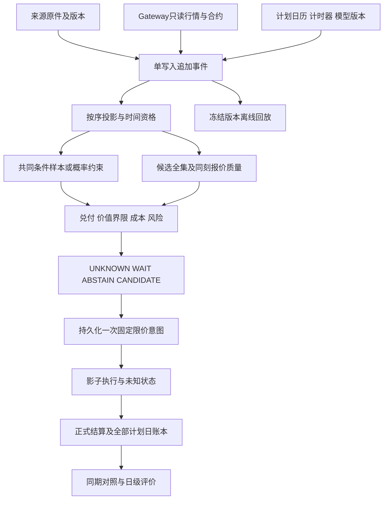

# 第二轮架构、研究与详细施工方案

版本 0.1 · 2026-09-16（北京时间） · **T0–T5 ENGINEERING_PASS / T6 SCHEDULED OBSERVE_ONLY：用户通过U17“按照方案施工”授权实施。U18已确定纽约9月16日观察日；全天证据待验收，正式效果参数仍未冻结。**

依据：用户本次要求“开始本项目的第二轮研究……深入分析，反复验证……先形成详细施工方案”，记为 [U16](DECISIONS.md)。采用用户指定的 iHarness 1.1 只读路由，以可证伪问题、简单对照和分阶段交付组织研究；不修改 iHarness。附件中的施工措辞是外部建议，不是本次执行指令。

本方案是第二轮的主维护入口，整合 [原下一轮影子计划](NEXT_SHADOW_PLAN.md) 的 E1–E7，保留[第一轮方案](DEVELOPMENT_PLAN.md)和旧运行的原始含义。数学、源码与外部资料的复核结论见[第二轮审查及验证证据](../research/ROUND2_REVIEW.md)，可复跑材料见[验证目录](../research/round2-review-2026-09-16/README.md)。

## 1. 第二轮要交付的能力

**保留已有行情、证据和五账本底座，新增“条件兑付 → 同期成本 → 价值判断 → 单次影子意图”的可回放链路。** 系统必须能解释一张蝶式为何有价值、为何不值得、以及哪些信息仍不足。

本轮采用以下范围建议，接受施工方案时可一并确认，不把普通字段和工程选择逐项交回人类：

- 研究对象：同日到期 SPXW PM、等翼宽看涨借记蝶式，每个独立反事实策略最多一次意图、最多一组、持有至正式结算。
- 主比较先固定 25 点翼宽、沿用 6.25 点含估算直接费用预算。价值内核支持其他正翼宽用于数学测试；本轮不从多翼宽搜索中挑一个“盈利版本”。这些约束是可比较起点，不是已证实的最优参数。
- 新价值策略命名 `DV1`，新执行模型命名 `FIXED_LIMIT_SHADOW_V1`；原 S/F/FG/FP/FGP、G0/P0、3秒/10秒运行原样保留。不能把修复后结果覆盖历史。
- 目标函数为一组、预算约束内的预期美元净收益，另含现金。ROC、命中率、最大值、模型置信度不替代该目标。各反事实账本不相加为账户收益。
- 遵循 U15：分布价值优先，允许有证据的中心偏移，方向贡献单列。去方向消融不是自动否决整个策略的门。
- 本轮先交付离线工具与研究契约，再验收连续只读影子日。实际运行日期、时间与值守责任在启动清单中确定；本方案本身不启动采集、心跳、模拟券商或实盘。

### 四种完成状态分别验收

| 层次 | 第二轮可交付的结论 | 不能代替的结论 |
|---|---|---|
| 数学正确 | 给定合法分布/约束与成本，兑付、界限、现金选择正确 | 分布真实、模型校准或有交易优势 |
| 工程完整 | 可追溯时点、完整候选、固定限价、恢复、结算、冻结回放成立 | 可以实际组合成交 |
| 数据可用 | 明确多少独立日、何时可用、对应什么预测和报价 | 38个网页评分日已成为38个可交易样本 |
| 经济识别 | 有足够数据后，按冻结方案评价完整策略的日级费后增量 | 测试通过、零成交或单日盈利自动证明优势 |

**数据不足时，第二轮可以完成工程，研究结论必须为 `NOT_IDENTIFIED / DATA_NOT_READY`。不能用合成密度补足真实证据，也不必等作者公开私有算法才建设价值工具。**

## 2. 外部方案的采用与修订

| 外部建议 | 处理 | 第二轮具体落实 |
|---|---|---|
| 保留模块化 Python、事件与回放 | 采用 | 一个有序写入者；纯计算模块不接触券商；不建设微服务 |
| 按期望兑付减可执行成本选结构 | 采用 | 显式保存全候选价值及现金，P0仍作为最低成本对照 |
| 样本、直接兑付、概率约束三种输入 | 分级采用 | 共同加权样本与简单完整分箱界限先做；直接兑付留能力接口；一般重叠约束LP后移 |
| 首次稳健正价值触发 | 有条件采用 | 先明确“稳健”的证据类型、时点条件与模型资格；不是任意模型集下取最小值就自动合格 |
| 最优停止/Bellman | 理论保留，实证后移 | 第二轮只有固定时点和首次价值触发；不估计未知的未来机会转移 |
| 预算与限价分离、通用日历和冻结代码回放 | 采用，列为必做整改 | 建新契约，不改老运行的语义 |
| 一次扩张中心、翼宽与时间 | 收缩 | 中心选择先做；固定翼宽；时机单独比较；防止无法归因 |
| “旧预测 + 新报价”即可持续估值 | 补充条件 | 保存信息截止；需要经验证的条件更新或同龄期模型，否则只报旧信息条件估值 |
| 空候选返回ABSTAIN、参考程序立即ENTER | 不照搬 | 缺少候选覆盖输出UNKNOWN；计算候选与持久化意图、假设成交分层 |
| 参考包15项测试通过 | 已独立复跑 | 只证明限定假设下数学算例；新增边界检查和真实冻结回放，见审查报告 |

当前 commit 与附件审查基线同为 `5c3626dafe3b855fd368d2b0e1a892c217360457`。本次没有发现主公式的实质错误；主要风险在输入识别、因果条件、状态语义和评价口径。两份 blueprint 内容相同、包内4项哈希均匹配。

## 3. 数学契约和信息边界

### 3.1 兑付、成本和目标

固定同一正式结算目标 T，中心 K、单边翼宽 w、完整一组、乘数 M=100：

```text
b(s;K,w) = max(w - |s-K|, 0)
v_t = E_P[b(S_T) | I_t]
c_t = net_debit_points + entry_fees_USD / M + nonduplicated_cost_points
J_t = v_t - c_t
PnL_USD = M × (b(S_T) - net_debit_points) - direct_fees_USD
```

日内初版忽略资金时间价值；以后扩期限须统一贴现/终值口径。若费用随结算状态变化，将其放入收益函数；不能都当已知常数。报价已含买卖价差，不能再把同一价差作为滑点扣一次。收费项目缺失时标估计场景或UNKNOWN。

完整借记结构且成本c为常数、c>0时，最大损失Mc、最大净兑付M(w-c)；0<c<w时盈亏平衡K±(w-c)。费用随结算状态变化时，最大损失须对完整收益函数取最坏值，不能仍机械使用常数Mc。c≥w为支配性拒绝，仍保留记录。自然净借记≤0或≥w需查盘口/合约与质量，不能静默丢掉后只展示好候选。腿不完整不受这套风险界限保护，本轮不模拟逐腿建立仓位。

若 `v∈[v_L,v_U]`、`c∈[c_L,c_U]`，保守外包络为 `J∈[v_L-c_U, v_U-c_L]`。若成本与终值相关，使用联合收益模型；独立端点相减只能作为外界限，不能冒称紧界。

### 3.2 接受的计算形式

| 输入能力 | 计算方式 | 必须保留的限制 |
|---|---|---|
| `WEIGHTED_SAMPLES` | `sum_i ω_i b(s_i)`；所有候选共享同一组样本、权重与版本 | 有限非负权重、和为1；不静默归一化截断尾部；样本数不是独立交易日数 |
| `PARTITION_MASS_BOUNDS` | `sum_j m_j inf_{I_j} b` 与 `sum_j m_j sup_{I_j} b` | 分箱互不重叠且覆盖全支持，边界/原子约定明确；未分配质量包括尾部 |
| `EXPECTED_PAYOFF_ONLY` | 直接给每候选期望与误差依据 | 本轮仅契约；无完整分布时不输出胜率、VaR、Kelly等派生量 |
| `SCENARIO_ONLY` | 正态、混合或其他声明假设的点估值/包络 | 仅合成验算和敏感性；不得进入正式价值账本 |

样本输入也检查 `0≤v≤w`、宽度递增时同中心兑付不减、同宽度中心平移的Lipschitz界、单位和目标一致。独立拟合各候选兑付未来还需跨结构一致性检查，初版共同样本避免大量不相容预测。

连续分布、光滑成本、内点且约束不绑定时：

```text
v = integral_0^w [F(K+u)-F(K-u)] du
∂v/∂K = F(K+w)+F(K-w)-2F(K)
∂v/∂w = F(K+w)-F(K-w)
```

中心/翼宽的边际兑付等于相应边际成本只是必要条件，不能保证全局最大。经验样本在原子与折点可能无普通导数；实际程序枚举挂牌有限候选，不使用连续求根选合约。积分公式在原子情况下要说明CDF端点约定，单点差异不影响该层积分。

P 是拟估的真实世界概率，Q 是定价概率。第二轮不从噪声盘口二阶求导恢复完整Q；直接比较蝶式的观察成本。`w²p(K)`仅为窄翼近似；本轮25点翼宽用完整兑付函数。P−Q差异可能是风险补偿，不自动构成套利。[Breeden–Litzenberger原论文](https://www.reflex-research.com/Douglas_Breeden_Robert_Litzenberger.pdf)

### 3.3 不确定性不得混为一列

每个输出必须有 `uncertainty_kind`：

1. `IDENTIFICATION_BOUND`：在声明概率约束内的价值界限；来源概率本身未校准不代表真实概率一定在其中。
2. `MODEL_ENVELOPE`：预声明模型情景的最小/最大值；不是95%置信区间。
3. `STATISTICAL_INTERVAL`：明确估计方法、置信水平、独立日、训练与验证划分；选择多个候选/时点后的推断另处理。
4. `POINT_ONLY`：只有点估值；不填造上下界或“保守EV”。

`DV1`正式候选必须有预注册的可用证据类型和阈值h。研究工具可输出任意合法类型，但原始作者区间约束或单个正态假设不会自动获得候选资格。阈值h（点）在成本之外，只计算一次；合成夹具h=0用于逻辑测试，不是正式参数。

本次反例：即使将7575–7633视为精确50%终值概率，K=7605、w=25的期望兑付仍允许0至12.5点；示意成本6.25时EV界限为−6.25至+6.25。目标日期冲突与概率校准问题还未计入。**接口必须支持 `VALUE_UNIDENTIFIED`，不能从这个区间反推一个唯一正态密度。**

### 3.4 预测有效期与条件更新

`p(S_T | I_a)`在来源时点a可用，不代表到较晚t仍等于`p(S_T | I_t)`。新价格、修订、时间流逝和报价本身可能改变条件兑付；依据价格挑选时点还会改变被选样本分布。

因此分开保存：`information_cutoff`、`computed_at`、`available_at`、`conditioning_as_of`、`source_age`、`conditioning_policy_version`。简单复制旧密度只记 `STALE_INFORMATION_VALUATION`；不伪称它已响应最新现价。

第二轮先实现：来源时点/固定龄期的估值；相同时点分箱的简单经验分布；按因果特征估计的更新接口。没有足够同龄期数据时，动态策略只做观察和合成状态测试，正式输出 `MODEL_NOT_READY`。未收到作者第二预测不是系统预测“稳定”。

## 4. 架构与模块边界



### 4.1 代码落点建议

| 文件/边界 | 工作内容 | 与现有实现关系 |
|---|---|---|
| `contracts.py`（新） | 带schema的运行/预测/分布/价值/意图对象；严格验证 | 标准库dataclass即可；不为schema新增服务 |
| `forecast.py`（新） | 原件清单、校验事件、修订/撤回、目标资格 | 替代新模式cfg内固定forecast；旧cfg读取不变 |
| `distribution.py`（新） | 样本与分箱适配器、能力声明、数据就绪门 | 纯函数，不能联网或回写研究参数 |
| `valuation.py`（新） | 兑付向量、界限、费用口径、现金、排序解释 | 可复用兑付公式；不直接调用旧Engine选价流程 |
| `policy.py`（新） | 固定时点/首次价值触发状态机 | 每组独立反事实状态，输入全为冻结引用 |
| `shadow.py`（新） | 固定净限价、延迟、TTL、失效、假设成交 | 与旧“预算内即可成交”模型隔离 |
| `calendar.py`（新） | 交易日、时区、到期终止、半日市 | 正式日程不依赖手工拼UTC |
| `market.py` / `collector.py` | 新版候选订阅、完整质量原因、覆盖与性能度量 | 保留有序包边界、只读消息白名单；版本化修改 |
| `runtime.py` / `cli.py` / `events.py` | 调度、只读回放分派、持久化先行、恢复/收尾 | 旧入口仍可运行旧协议；V2契约显式路由 |
| `evaluation.py`（新）及 `report.py` | 日级评价、成对覆盖、成本场景、方向消融 | 纯离线；缺失不得合并成零收益 |

文件名是施工落点建议，可在不改契约的情况下合并小文件。不要先搭一套插件框架或抽象层再做第一条价值闭环。

### 4.2 关键接口

```text
normalize_forecast(raw_assets, review_event) -> ForecastSnapshot | ValidationIssues
build_distribution(forecast, features, matured_dataset, model_manifest) -> DistributionSnapshot
quote_universe(market_projection, universe, evaluation_clock) -> CandidateBatch
value_candidates(distribution, candidate_batch, fee_model, valuation_spec) -> ValuationBatch
policy_step(previous_state, valuation_batch, clock_event, run_spec) -> Decision
shadow_step(intent, quote_event, observation_coverage) -> ExecutionEvent
settle_all(run_manifest, settlement_revision) -> LedgerRevision
replay_frozen(run_manifest, output_directory) -> ReplayCertificate
```

所有纯函数禁止读取当前壁钟、最新网页、实时账户或未声明随机种子。引用输入通过内容hash与事件seq解析。复杂模型若异步完成，必须在完成并持久化后成为可用事件；禁止计算用时被回填到请求时点。

### 4.3 最小数据契约

| 对象 | 必需字段（组） | 拒绝/未知规则 |
|---|---|---|
| `RunSpec` | schema/mode/run_id/strategy_id；会话与目标；计划时点/候选生成；数量/预算/限价/TTL；数据/代码/模型/费用/日历/环境hash；计划日全集 | 模式不匹配、必需字段缺失不启动；未知阈值不得成为正式策略 |
| `ForecastSnapshot` | source_product_id/model/forecast版本；target_session/settlement/type；published_at可空；first_seen/validated/available；逐字段语义、原件hash与定位；修订链、状态 | 日期含糊、touch混终值、跨产品拼接、撤回、迟到不合格；reviewer仅是身份记录 |
| `DistributionSnapshot` | information_cutoff/conditioning_as_of/computed/available；目标；measure=P_ESTIMATE/Q_IMPLIED/ASSUMED；representation；样本与权重或分箱；训练成员清单hash、标签成熟/取得时间；独立日/n_eff；模型及校准状态；更新规则 | Q/ASSUMED不得冒充正式P；未成熟标签、错目标、非有限数、非法概率、尾部遗漏、过龄期、模型未就绪分别编码 |
| `CandidateBatch` | planned_universe_id/hash；每个结构的三腿conId/权重/K/w/expiry/class/currency/M；评价截止seq；腿级引用与资格原因；coverage分母/分子 | 不合格候选仍占全集一行；缺合约不等于没有价值 |
| `ValuationRow` | value_point或bounds；uncertainty_kind；cost_components与场景；edge与单位；max_loss；quality/model/source资格；rank/reason；所用版本 | null必须附原因；不允许NaN、数值0充缺失；所有候选同模型与同刻报价投影 |
| `Decision` | scheduled/processed时间；输入hash/seq；state/reasons；选择与未选理由；coverage；可用信息时间；policy版本 | 只能引用当时可用记录；UNKNOWN与经济拒绝分开 |
| `Intent` | intent_id/run/strategy/session；持久化时间；锁定合约、预测与模型版本；qty=1；净限价L；含费预算B；费用预留；eligible/expires；clock_epoch | 同一键至多一次；重启不重发；不随新候选自动换结构 |
| `ExecutionEvent` | intent_id；模型版本；假设结果；确认报价引用；实际假设净借记和费用；独立数据缺口列表 | 只有影子假设状态；没有券商orderId/fillId伪装真实成交 |
| `SettlementEvidence` | series/session/value/source资产hash；published/retrieved/review；revision/supersedes | 非本目标或未正式发布不结算；修订只生成新报告 |

数值策略：净价、费用、预算和排序用Decimal/规范字符串；积分可用float64，固定容差与舍入版本。展示用四舍五入不得参与阈值判断。跨平台数值结果按明确容差比对；同一冻结环境的决策/账本语义必须一致。

## 5. 数据建设与最小模型路径

### 5.1 当前数据盘点与可用性

已掌握一个交易日的真实行情/诊断流；002/003/004共3,707,491条事件，25个账本实例为20规则拒绝、5未知、0确认影子成交。本次全量冻结回放通过。它们是一个市场日，不能用来拟合并验证多特征条件分布。

既有40个日内预测正文索引和公开38日区间账本可做来源审查/探索性误差研究；它们不是本系统当时已接收的完整预测、同刻候选报价和日内更新样本。不得把这些材料升级成事前可交易测试集。[现有来源覆盖](BALDER_SOURCE_INDEX.md)

第二轮建立 `DatasetManifest`：按来源产品、交易日、预测龄期与目标汇总，分 `PROSPECTIVE_CAPTURE / RETROSPECTIVE_SOURCE / SYNTHETIC_FIXTURE`；记录缺失字段、修订、时间证据和可使用任务。原始预测标签直到正式目标结果已取得并校验后才成熟。

### 5.2 两条可以独立推进的工作线

| 线 | 立即能做的交付 | 不能越过的限制 |
|---|---|---|
| 工程线 | 所有接口、离线三类价值案例、因果状态机、日历/回放/只读全天生命周期 | 没有真实分布时用明确合成输入验收，不宣称收益 |
| 证据线 | 建来源时点档案、训练集清单、基准、前瞻采集契约与就绪报告 | 历史缺同刻特征或报价就标缺失，不合成行情；不足时停止模型晋级 |

### 5.3 候选模型，严格从简单开始

1. **D0 约束界限**：仅使用语义明确的终值质量约束。中位数/区间不能唯一识别密度；初版支持完整互斥分箱以及一个区间加未约束尾部。重叠概率带不能相加。D0可独立完成并给出有用UNKNOWN。
2. **D1 简单共同残差样本**：先在固定时点/剩余期限分箱，比较现价锚点与来源锚点。过去日误差 `e_i=S_Ti-a_i`；当前样本 `s_i=a_t+e_i`。采用尺度时用 `z_i=(S_Ti-a_i)/scale_i`、`s_i=a_t+scale_t*z_i`，scale只能由当时可用信息计算。锚点不同分别建模型；不得把作者残差平移到现价就称其为已校准现价模型。
3. **D1的条件化扩展**：只有样本支持后，再增加“spot−pin”等少量特征；带宽、池化/收缩方式、时间分箱在训练期确定。第二轮先给出数据就绪与简单基准实现，不同时拟合OU、HMM、Gamma门和五个条件变量。

每个模型输出训练日数、日级有效样本数 `(sum_d W_d)^2/sum_d W_d²`、最大日权重、特征支持范围和校准误差。单日多次预测先控制日权重，不能靠6000路径或数百万tick抬高有效样本。数值最低样本门槛是估计器工作条件，不是盈利认证；正式阈值与校准容差在预注册前确定。

若历史只取得发布时点预测，D1只支持对应时点任务，不能制造所有30秒网格的历史训练特征。新增信息的更新规律必须经过分时段前瞻检验；在此之前动态 `DV1` 保持观察态。

## 6. 候选报价、选择与影子执行

### 6.1 候选全集与同刻比较

主比较建议：每个决策时点形成 `U_t = unique{K_spot, K_forecast−5, K_forecast, K_forecast+5}`，w=25。K来自最近5点网格、等距取低，再验证真实挂牌合约。至多4个中心、12个所需腿，重复合约去重。没有合格预测时来源依赖的U_t记未识别，独立现价基线仍按自身条件观察。

固定时点组在截止锁定候选；动态组在每个预声明评价点锁定该点全集。现有预热缓冲最多40个期权订阅可沿用为工程上限；本轮不为补候选无界扩订阅。实际请求容量不足应降为观察不完整，不按已收到的候选偷偷排序。有限集合“最优”只在其范围内成立。

同一评价点，所有比较算法使用同一个 `market_snapshot_seq`、相同来源和分布版本、相同费用及资格过滤。候选不全时主比较UNKNOWN；可展示可见子集估值，但不作为全候选主成绩。独立单中心旧基线更早可用的结果另报，不把时间差说成选价收益。

报价继续使用两翼ask减两倍中心bid的合成natural；保留价格时间、确认时间、数量、请求ID、连接代次、包完成边界和全部不合格原因。必要侧确认≤1秒、对侧≤2秒、跨腿≤1秒、数量1/2/1先沿用。报价合格不是组合订单必然成交。[IB行情回调文档](https://www.interactivebrokers.com/docs/tws-api/doc/quick-start/requesting-market-data)

### 6.2 选择规则

先排除数据/目标/模型不合格项，再检查成本与最大损失；对符合DV1证据规则的候选按保守EV下界降序，同值按更低含费成本、再按中心较低排序。主轮固定翼宽；数学枚举扩宽时再把较窄翼宽列入固定tie-break。现金值为0，严格超过h才生成候选，边界等于h不交易。

`UNKNOWN`：输入/覆盖不足或价值区间跨越资格门槛，附具体原因。

`WAIT`：当前未触发，时间窗口仍开放；同时保存该次是已知价值不足还是输入未知。WAIT不表示估计过Bellman继续价值。

`ABSTAIN`：本轮决策已终止且可确认未生成意图的规则结果。

`CANDIDATE`：价值与风险检查合格的结构，只有写入成功后才成为INTENT。不能把参考包的 `ENTER_ASSUMED` 直接映射为成交。

决策状态、输入质量和日结果分三列。即使因数据不足主动停交易、实际影子现金为零，该日机会与策略比较仍标不完整；不能据零现金推断没有价值机会。

### 6.3 固定限价和一次意图

```text
OBSERVING -> CANDIDATE -> INTENT_PERSISTED -> ASSUMED_FILLED -> PENDING_SETTLEMENT -> SETTLED
OBSERVING -> CLOSED_ABSTAIN / CLOSED_UNKNOWN
INTENT_PERSISTED -> EXPIRED_NO_FILL / CANCELLED / FILL_UNKNOWN
```

意图时冻结 `L=d0`（首次合格natural净借记）、`B=6.25点`（主比较建议）、费用版本与预留。L是不含费用的价格约束；B是风险约束。以后观察到的影子成交同时满足 `d≤L` 且 `d+fee/100≤B`，不自动追价，不重新挑中心。

初版只做影子净价，不声称L满足未来真实组合委托的最小跳动/路由规则；记录 `broker_limit_validation=NOT_TESTED`。要产生券商可执行订单草稿时另核合约/组合价位规则。

执行建议沿用1秒延迟、10秒TTL作单一版本基线（沿用004主组，未证明优于3秒）。在 `[eligible, expires)` 内、完整包之后检查新有效报价；报价变更或数量确认需发生于意图之后，不能靠旧缓存等待1秒就制造新执行证据。只在完整合成结构条件满足时记录 `ASSUMED_FILLED`，成交模型不是排队模拟。

一个策略/交易日最多一次持久化意图；未成交、过期或取消也消耗次数，不自动重试。该建议比“最多一次成交”更严格，可能丢掉后来机会，代价用于换取可识别的初版执行规则；重试策略留待另立实验。不同策略反事实分支各自一次、互不消耗盘口，但不是同时真实持有的多组账户。

断线、连接代次变化、进程重启、来源撤回/目标冲突触发既定取消或UNKNOWN；不得恢复旧意图的可成交性。普通新版预测不重定价在途意图，记录 `new_forecast_ignored_for_open_intent`；明确撤回或硬质量失效则取消。已假设成交后不因模型改观改写入场。

本次合成反例已证实旧Engine允许4.40点意图在4.90点、含费4.9644点时成交，因为仍在6.25预算内。这是旧模型既有定义。新旧模型必须并列命名，不把新固定限价假说回写成旧成交事实。

未触发成交且意图区间观测完整：`EXPIRED_NO_FILL`；数据断裂或有效确认缺失：`FILL_UNKNOWN`。自然价的合成机会也不证明真实组合可以成交，报告保持假设标签。若以后估计成交率，要检验成交条件下的收益，不能简单乘 `P(fill) × 无条件EV`。

## 7. 运行与证据的必做整改

### 7.1 日历、模式与时间顺序

- `LEGACY_DIAGNOSTIC_V1`解析既有cfg；新建 `VALUE_RESEARCH_SHADOW_V1` 和 `OBSERVE_ONLY_V1`。合成回放用独立mode，真实影子拒绝 `SCENARIO_ONLY` 输入。不同模式不依赖“reviewed_by=Codex”判断交易资格。
- 从 `America/New_York`、版本化Cboe交易日历与合约详情生成UTC时点，区分RTH结束、当日到期交易终止与结算目标。通常到期SPXW为16:00 ET、半日13:00 ET；不套用一般期权16:15。日历与合约信息冲突则停止该次资格判断。[Cboe规格](https://www.cboe.com/tradable-products/sp-500/spx-options/spx-specifications)、[交易日历](https://www.cboe.com/about/hours/us-options/)
- 建议采集常规会话；固定对照10:05 ET；动态观察10:05至到期终止前30分钟，每30秒评价一次。半日自动截短；这些是待确认的研究起点，不能从09-15结果倒推最优时间。
- scheduled_time、processed_time和durable_seq分别保存。冻结截止前可用投影；计时事件同刻先于新市场包的规则显式版本化。决策处理延迟超过冻结工程容差时标 `MISSED_DECISION_DEADLINE`，不回填过去报价。容差通过性能测量确定，未冻结不启动正式日。
- 延迟/TTL只在同一 `clock_epoch_id` 内比较单调钟；重启、系统重启或异常壁钟偏移另起epoch并终止旧意图。未来信息事件不能进入先前valuation。

### 7.2 持久化和恢复

一个写入者维护事件全序；输入落盘成功后才对策略可见，意图落盘成功后才进入影子执行。持久化失败进入只观察或终止，不能记录一个没有证据的假设成交。派生事件与状态恢复需要幂等键 `(run,strategy,session,intent_index)`；崩溃后回放已提交状态，不重新创建意图。

先测现有SQLite逐回调事务的吞吐与时延，再决定是否批写。新增接收、队列、写盘完成、评价开始/完成时间；现有local_callback_receipt不能识别网络与库解码之前的延迟。p99只能按已实际测得的段落命名，不称“交易所到本机p99”。

性能验收以同一候选容量和代表性峰值流测试：队列有界、无静默丢事件、0次以超龄数据放行、决策时限违约完整记录。若引入有界批写，仍须持久化屏障和可重复序号；不能用吞吐收益抵消证据丢失。

恢复从第一天纳入统一监督：有限退避重连，新的订阅代次，全质量预热后恢复观察；不重开已消耗入场窗口。只读行情消息白名单保持封闭，模型/回放进程不持有Gateway对象。

### 7.3 冻结回放与结算

`RunManifest`覆盖源码、必要运维脚本、依赖锁、Python/平台、配置、schema、模型/训练清单、费用、日历、原始事件分段hash及最后seq。当前source_manifest仅含src和两份依赖文件，应扩大新版本范围；版本字符串不足以证明环境相同。

回放入口先验证快照哈希，在独立子进程加载已批准的本地冻结代码，禁联网、禁券商、禁pyc写原件。快照缺失/损坏则失败，不退回当前Engine。验证结果写新目录，旧 `replay.json`、决策与结算不覆盖。本次审查的只读脚本是验证工具，不作为已经实现的正式分派器。

所有主/控制组统一结算。相同证据再次调用应幂等返回原revision；修订生成新revision并记录supersedes，所有账本使用一致的证据版本。半日市不能硬编码16:00才接受正式证据。尚未正式发布时PENDING，失败不伪造结算值。

本机原始行情保留在var；仓库可提交合成夹具、摘要和必要许可内证据。真实便携包仅取可再分发的最小事件片段，附合法来源/脱敏说明；不能把价格改造后的样本称原始市场重放。异地备份目的地未定时先做本地恢复演练，不自动上传。

## 8. 研究设计：一次只识别一种增量

### 8.1 先声明估计对象

固定候选与时点的 `J_t` 是立即完整成交条件下的估值，不是整条限价策略的EV。最终策略评价包括等待、未成交、缺失、跳过和费用，单位为每个计划交易日一组的美元结果；风险预算固定，不用不同分母的ROC胜出代替美元增量。

单时点兑付预测误差是诊断，最终只在完整“选中心—选时点—执行”链上报告主策略成绩。对全部时点估值时按日聚合、限制同日权重；不把30秒网格算成独立样本。

### 8.2 对照矩阵

| 问题 | 比较 | 固定的因素 | 解释边界 |
|---|---|---|---|
| 作者中心有无增量 | 新同期 `S* / F*`，附 `SG* / FG*` | 同评价时点、同门、w/数量/成本/执行 | SG补齐“门是否只筛安静时段”的检验；G0未知单列 |
| 价值选价有无增量 | `CHEAP_U / DV1_U`，另列最近预测中心 | 同U、同完整报价屏障、同模型版本与执行 | 不与信息更早的旧FP/F直接做算法归因 |
| 价值门是否有用 | 共同预定结构的value-gate on/off诊断 | 不同时优化中心和时点 | 条件样本筛选效应与结构优化分开 |
| 择时有无增量 | `DV1_FIXED / DV1_FIRST_TRIGGER` | 同候选生成函数、模型、w、预算、执行 | 时点变化带来的报价和分布更新是策略整体效果，非Bellman最优性 |
| 来源分布超过简单模型吗 | 现价锚点简单剩余波动/误差基线与来源条件模型 | 同期限、相同时点及训练/测试日 | 预测改善与净收益改善分别报告 |
| 方向来自哪里 | 位移、形状与价格成本三项，见下 | 同候选和时点，使用相同报价 | 属模型消融/归因，不宣称因果的可复制对冲收益 |

一次报告一个预注册主比较，其余标次要/探索；不是建立十几组后选择最好看的结果。旧五账本保留历史意义，统一执行的新对照加星号/新ID，不能复用旧名字混合结果。

### 8.3 方向归因的最小可行版本

已有合格共同样本时，以同期限可观察参考a（本轮默认spot；远期只有报价和构造都合格才使用），选预声明定位量m（先用加权中位数）：`s_i^0=s_i-m+a`。在固定结构K上比较 `v_P(K)−v_P0(K)`，得到分布位置移动的模型贡献。标为“中位数重定位消融”，不声称去掉全部Delta风险或真实世界方向风险溢价。

选中中心K*相对参考K0的估值差可恒等拆分：

```text
J_P(K*) - J_P(K0)
= [v_P(K*)-v_P0(K*) - v_P(K0)+v_P0(K0)]   位置与结构交互
  + [v_P0(K*)-v_P0(K0)]                   重定位后形状贡献
  - [c(K*)-c(K0)]                         价格成本贡献
```

这是一条固定分布/结构下的代数归因，不是三条可相加交易策略。另跑“去位移后重新选择”的策略消融，其差异包含重选效应，分表报告。模型均值不可靠或不存在时不强求均值重置。

至少报告 `K−spot`、预测位移、两侧盈亏平衡距离；组合Delta仅在可靠、带时点与模型版本的Greeks可得时报告，否则UNKNOWN，不由几何中心推断Delta中性。本轮不引入期货动态对冲。

### 8.4 时间划分、指标与失效判据

训练、调参、评价按整交易日时间顺序隔离；训练标签必须在训练截止前已成熟且实际取得。测试日数据不能选择带宽、门槛、h、时点或候选规模。研究版本选择后封存，前瞻观察不中途换规则追好结果。[回测过拟合研究](https://www.davidhbailey.com/dhbpapers/backtest-prob.pdf)

评价面板：

- 预测：同期现价对照、quantile覆盖与宽度、样本分布CRPS；离散分布PIT须采用预声明的随机化或区间处理；直接兑付预测看偏差/MAE或平方误差，不伪造PIT。
- 决策：全部计划日、资格覆盖、UNKNOWN分解、意图数、确认的影子假设成交、费后日损益、成对策略差、最大可能损失、资金路径及费用敏感性。
- 缺失：计划全集口径和共同可观测子集分别报告；后者不外推全样本。经济日结果未知时不算完整累计收益/最大回撤。已知不交易的现金可为零，固定订阅成本仍独立列支。
- 统计：成对日差按日/连续日块估计不确定性；当日多个时点先聚合。同一候选最大化及反复观察时点产生的选择效应必须包括在验证链内。小样本只做描述，不能靠bootstrap制造可信尾部。

正式效果预注册还需要最小经济增量δ、可接受区间半宽ε、测试误差水平、最大评价日与固定复核点、成本口径。`n≈(z×s_day/ε)²`仅作初步精度规划；序列依赖、重尾与多重比较要求调整。未得到δ或日级方差时不拍板“30天证明盈利”。

**停止/降级条件**：来源目标持续不明；关键候选覆盖不足且对照不再公平；模型超出训练支持；条件兑付不优于简单基准；合理费用/执行敏感性消除增量；测试结果依赖反复调参或选缺失日。触发后保留负结果、停止候选晋级，工程数据采集是否继续按当批目的决定。

## 9. 按交付物施工的顺序

以下表格保留接受时的任务和验收定义。U17实施后T0–T5离线工程已通过；U18指定9月16日观察日，T6尚待真实全天证据。实际状态见[实施记录](../ROUND2_IMPLEMENTATION.md)。

| 顺序/任务 | 具体改动与交付 | 依赖 | 验收出口 |
|---|---|---|---|
| T0 保护基线 | 旧run清单与golden结果；V1/V2路由规范；新产物目录与schema版本 | 接受施工范围 | 原35测试保持；002/003/004输入/决策hash不变；模式混用失败 |
| T1 离线价值闭环 | contracts/distribution/valuation；三种主算例、完整候选表、现金和UNKNOWN；费用分解 | T0 | `evaluate`对冻结输入产生确定性JSON/中文报告；不接Gateway即可验收 |
| T2 来源与训练资格 | forecast、DatasetManifest、可用/成熟时点校验、D0约束、D1简单基准和就绪报告 | T1 | 正常/晚到/修订/错产品/错目标、未成熟标签反例；数据不足不输出正式候选 |
| T3 报价与策略 | 新U_t、完整原因/coverage；policy和fixed-limit shadow；预算/限价与单次意图区分 | T1；真实候选依赖T2 | 同流同期选择；固定限价涨价拒绝；过期/重启不重试；合成正价值可走到结算 |
| T4 生命周期与回放 | 日历、运行模式、截止屏障、恢复、性能测量、冻结环境分派、统一结算与报告 | T0，集成T2/T3 | DST/半日/宕机/延迟/崩溃恢复/主控制修订结算/快照损坏全部有用例 |
| T5 对照与研究归档 | 同期S*/F*/SG*/FG*、CHEAP/DV、固定/首次触发报告，方向恒等分解，日级评价与缺失界限 | T2–T4 | 对照引用同批输入；无测试日泄漏；负收益/UNKNOWN保留；不把多分支相加 |
| T6 一日验收及冻结包 | 新运行清单、启动检查、连续观察、正式结算、冻结回放、紧凑日报与停止记录 | T1–T5；另确定日期和责任 | 一个完整计划日可解释；零成交仍可工程通过；模型未就绪时明确OBSERVE_ONLY |

最短关键路径是 **T0 → T1 → T3合成验收 → T4集成 → T6**；T2的数据获取与T5研究准备可交错推进。真实价值策略的T6另依赖T2的数据就绪，不通过则只验收观察模式。这是工作依赖说明，不自动启动多个代理。

首个可展示成果应是T1：给定条件样本与报价，立刻看到全候选的兑付、成本、EV与现金，并可复跑。不能先花数轮做平台治理而仍没有价值输出。

### 9.1 验收用例清单

| ID | 输入/动作 | 应有结果和保存证据 | 对应任务 |
|---|---|---|---|
| A01 | 最低成本与最大兑付中心均非最大EV的合成曲线 | 选择正确EV结构；全候选与成本保留 | T1 |
| A02 | 全负EV、等于h、超预算、c≥w | 现金/拒绝，绝不为必须成交放宽h | T1/T3 |
| A03 | 同median/概率区间、不同内部质量 | 不恢复唯一密度；界限或能力受限 | T1/T2 |
| A04 | 权重负值/NaN/漏尾/错目标/原子分布 | 拒绝或按明确原子规则计算；独立三腿兑付一致 | T1 |
| A05 | 高斯闭式/数值积分/样本；离散样本枚举 | 数值容差通过；不使用不成立的连续导数选合约 | T1 |
| A06 | 目标Tomorrow冲突、晚到修订、必要图片后到 | available_at不前移；原决策不变；不合格不入正式账本 | T2 |
| A07 | 标签未成熟、下午复用晨间分布、留出日调参 | 训练/条件资格失败；留出处于只评价路径 | T2/T5 |
| A08 | 所需侧撤回、旧req/代次、大小不足/超龄、候选缺1腿 | 全原因保存、coverage不满；不缩小主全集择优 | T3 |
| A09 | 报价4.40→4.90且仍在6.25预算 | 新固定限价不能成交，旧基线仍按旧定义 | T3 |
| A10 | 意图前缓存、延迟/TTL边界、过期后便宜价 | 旧缓存不充新证据；expires同刻及以后不成交 | T3 |
| A11 | 无完整观察、完整观察无成交、规则拒绝 | UNKNOWN、ASSUMED_NO_FILL、ABSTAIN分开 | T3/T5 |
| A12 | 意图已落盘后崩溃、断线恢复、来源撤回 | 不创建第二意图；旧意图取消/未知可追溯 | T3/T4 |
| A13 | 春秋DST、周末假日、半日、同刻截止/新报价、时钟回退 | 日程正确；截止投影稳定；不跨clock_epoch计TTL | T4 |
| A14 | 主/控制结算重复调用、正式值晚发布及修订 | 幂等、PENDING、新revision；决策hash不变 | T4 |
| A15 | 当前代码变动、快照缺失/损坏、依赖不匹配 | 自动用正确快照或失败；禁止回退当前代码 | T4 |
| A16 | 峰值流/磁盘写失败/队列积压 | 已声明时延段度量、0次超龄误放行；不能无证据成交 | T4 |
| A17 | 对照候选不齐/时点不同/同日多次更新 | 只比较匹配批次；覆盖偏差和日权重可见 | T5 |
| A18 | 位移消融重新选择与固定结构分解 | 代数恒等式通过；重选效应另列，不伪称Delta对冲收益 | T5 |
| A19 | 一个授权计划日从预热到正式结算 | 来源、覆盖、全部决策、缺口、结算、最终回放与停机齐全 | T6 |

自动化单元/集成测试负责A01–A18；A19需要真实只读观察，不能由夹具替代。历史002/003/004是回放回归基线，不是新DV1性能样本。

### 9.2 计划中的命令和产物

以下接口已实现；具体参数及合成/观察模式边界见[第二轮运行手册](../ROUND2_RUNBOOK.md)。正式实时价值影子入口仍需数据与效果预注册，不因离线接口完成而启用：

```text
spxlab evaluate --bundle <frozen-input> --output <new-directory>
spxlab dataset-check --manifest <dataset-manifest>
spxlab validate-plan --plan <run-spec>
spxlab observe / shadow --plan <frozen-plan> --directory <new-run>
spxlab replay-frozen --run <run> --output <new-proof-directory>
spxlab settle-all --run <run> --evidence <revision>
spxlab compare --study <frozen-study> --output <new-report>
```

每次运行交付 `run-manifest`、预测原件引用、model/dataset/universe清单、追加事件、候选与价值行、意图/执行轨迹、主控制账本、结算版本、回放证明及一页中文摘要。每个跳过和UNKNOWN能追到输入seq与原因，源码以相应测试名连接验收ID。

## 10. 下一轮明确后移的事项

| 项目 | 本轮保留什么 | 后移原因与重启条件 |
|---|---|---|
| Bellman/LSMC继续等待模型 | 数学基准、所需状态和连续候选档案 | 当前缺未来预测/价格/流动性联合转移样本；先证明优于首次触发、独立日评价 |
| OU/HMM/跳跃/复杂Gamma收敛门 | 特征语义、候选解释、数据接口 | 一日流和公开标签不足以识别；简单同期限基准稳定且存在增量需求后再建 |
| 一般重叠分位约束/连续稳健LP | 互斥分箱和尾部界限 | 正式连续包络/原子边界/不可行诊断需单独验收；不能直接把有限网格LP当真实界限 |
| 独立直接兑付回归、多模型融合 | capability接口、共同样本基准 | 需跨结构一致性、训练误差与选择校正；先用共同样本减少自由度 |
| 翼宽优化、1–10DTE、非对称结构 | 泛化数学内核的合成检查 | 会改变风险/期限/候选维度；需相应分布、报价、费用和更长成熟期 |
| Kelly、多组、多仓位、提前退出和再入场 | 固定一组风险报告 | 当前无可靠完整联合分布/成交模型；会变成持仓和财富状态控制 |
| 真实组合簿、排队与成交概率模型 | fixed-limit影子标签和完整报价链 | natural不能证明组合成交；后续需专门数据及执行阶段授权 |
| 券商模拟与真实自动执行 | 只读隔离、明确无委托路径 | 账户、资金、成交/未知订单对账、风险处置为独立后阶段 |
| 运行时大模型读图/自动解释 | 人工校验适配口与原件溯源 | 不阻塞价值内核；需提取准确性、成本/延迟与注入隔离评估 |
| 分布式平台/云部署/异地上传 | 本地可恢复证据包 | 尚无容量证据要求；外部目的地和资料许可未确定 |

不把经济证据不足自动变成“再上复杂模型”。若简单方法没有可辨增量，下一轮也可以是收缩、增加数据或结束该假说。

## 11. 接受方案时真正需要确定的边界

U17更新：用户已明确“按照方案施工”，T0–T5离线施工范围与上文建议基线已接受，日常工程不再逐项请求许可。当前实现进度以[实施记录](../ROUND2_IMPLEMENTATION.md)为准。

U18已确定纽约2026-09-16采用 `OBSERVE_ONLY`，由当前任务检查来源并监督本机只读观察；需要人工Gateway认证时由用户处理。本日预检连接与合约时段已通过，完整采集与收盘验收待发生。正式效果预注册前还需确定δ、ε、h及费用/固定成本口径；它们不阻塞T1的离线价值工具。

接受施工不自动接受盈利结论、不自动打开后移事项，也不构成券商委托授权。正式效果预注册与T6运行清单保持独立状态。
